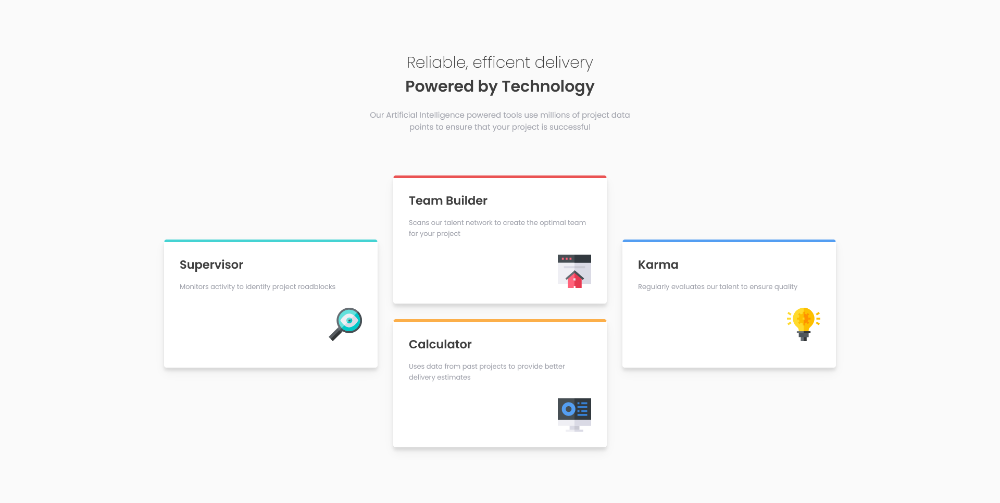

# Frontend Mentor - Four card feature section solution

This is a solution to the [Four card feature section challenge on Frontend Mentor](https://www.frontendmentor.io/challenges/four-card-feature-section-weK1eFYK). Frontend Mentor challenges help you improve your coding skills by building realistic projects. 

## Table of contents

- [Overview](#overview)
  - [The challenge](#the-challenge)
  - [Screenshot](#screenshot)
  - [Links](#links)
- [My process](#my-process)
  - [Built with](#built-with)
  - [What I learned](#what-i-learned)
  - [Useful resources](#useful-resources)

**Note: Delete this note and update the table of contents based on what sections you keep.**

## Overview

### The challenge

Users should be able to:

- View the optimal layout for the site depending on their device's screen size

### Screenshot



### Links

- Solution URL: [Add solution URL here](https://your-solution-url.com)
- Live Site URL: [Add live site URL here](https://your-live-site-url.com)

## My process

### Built with

- Semantic HTML5 markup
- CSS custom properties
- Flexbox
- Mobile-first workflow

### What I learned

How to use *after* pseudoelement to decorate. Credits to [Florin Pop](https://youtu.be/PcSUEo0P0GU).
This is the css code used to create the top borders:

```css
.card {
    background-color: white;
    width: 350px;
    padding: 2rem;
    margin: 1rem;
    border-radius: 5px;
    box-shadow: 0 10px 20px rgba(0, 0, 0, 0.05), 0 6px 6px rgba(0, 0, 0, 0.1);
    position: relative;
    overflow: hidden;
}

.card::after {
    background-color: red;
    content: "";
    height: 5px;
    width: 100%;
    position: absolute;
    top: 0;
    left: 0;
    border-radius: 10px;
}
```

### Useful resources

- [Tailwind box shadows](https://tailwindcss.com/docs/box-shadow)
- [Florin Pop livestream on youtube](https://youtu.be/PcSUEo0P0GU)